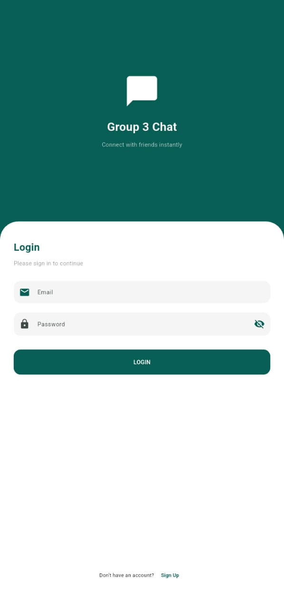
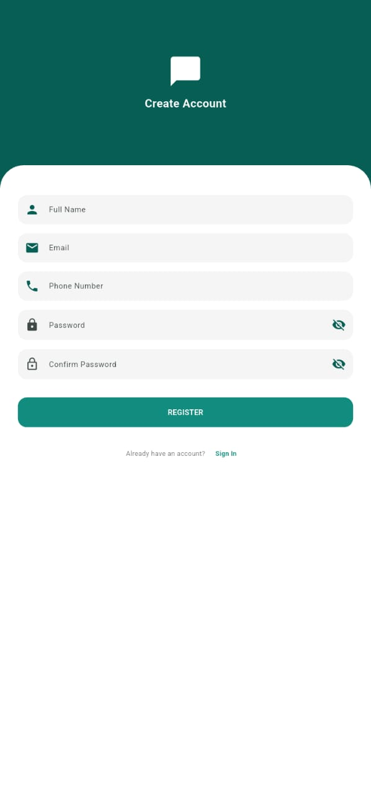
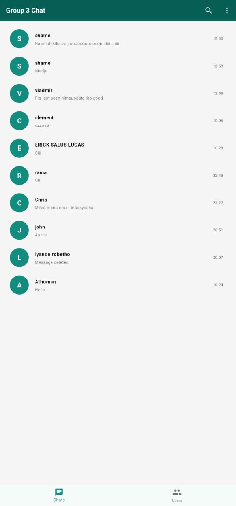
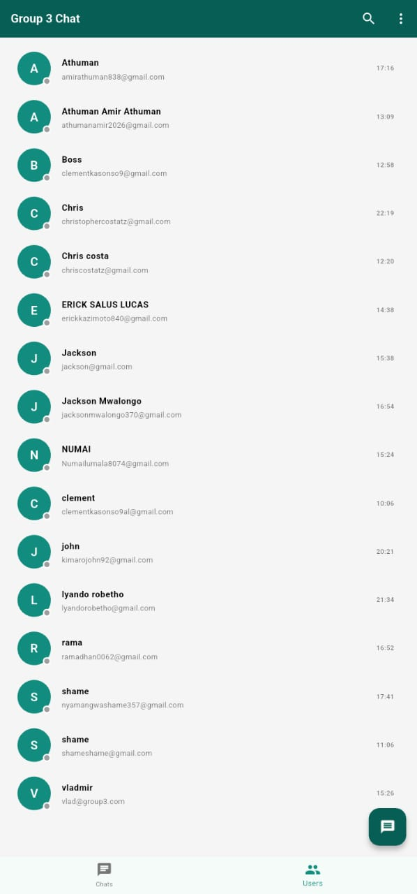
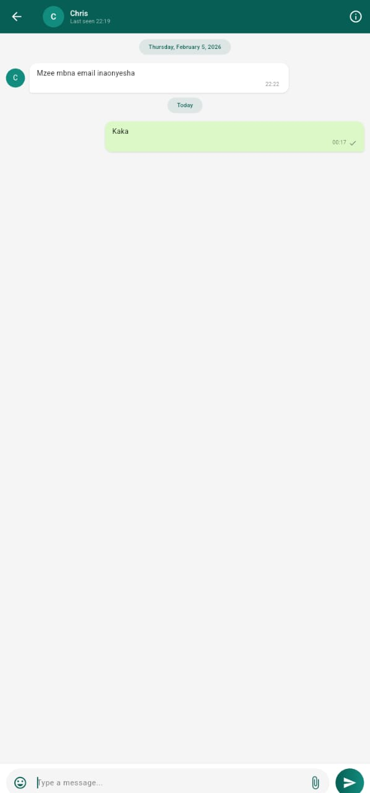

# Flutter Chat App

A complete Flutter chat application with user authentication, real-time messaging, user profiles, and push notifications.

## Features

- **User Authentication** - Secure login and registration system
- **Users List** - Browse and discover all registered users
- **Recent Chats** - Home screen displaying your conversation history
- **Real-time Chat** - Instant messaging with other users
- **User Profiles** - View detailed information about any user
- **Push Notifications** - Instant alerts for new messages
- **Logout** - Secure sign-out functionality

## Screenshots

### Authentication
| Login Screen | Registration Screen |
|:---:|:---:|
|  |  |

### Main Features
| Recent Chats | Users List | Chat Screen |
|:---:|:---:|:---:|
|  |  |  |

### Profile
| User Profile |
|:---:|
|  |

## Tech Stack

- **Framework**: Flutter
- **Backend**: Firebase
- **Authentication**: Firebase Auth
- **Database**: Cloud Firestore
- **Notifications**: Firebase Cloud Messaging (FCM)
- **State Management**: Provider

## GROUP MEMBER
1. ROBETHO JOHN LYANDO         NIT/BCS/2023/564
2. VLADMIR B. MASSAWE          NIT/BCS/2023/535
3. SHAME NYAMANGWA SHAME       NIT/BCS/2023/504
4. CLEMENT JUSTINE             NIT/BCS/2023/538
5. CHRISTOPHER COSTA           NIT/BCS/2023/517
6. RAMADHANI J RAMADHANI       NIT/BCS/2023/587
7. NUMAI L MUSSA               NIT/BCS/2023/501
8. ATHUMANI A. ATHUMANI        NIT/BCS/2023/514
9. JACKSON A. MWALONGO         NIT/BCS/2023/492
10. ERICK SALUS LUCAS          NIT/BCS/2023/579

## Developer Team

**Prepared, Designed & Developed by Group Three**
*Computer Science - NIT (National Institute of Transport)*
**Class of 2025/2026**

